# Phonox UI Gallery

A visual walkthrough of all major Phonox features, captured live from the application.

---

## Journey 1 — Onboarding & Profile Setup

When you first open Phonox, you are greeted with the profile selection screen. Create a new personal profile or pick an existing one. Every profile has its own vinyl register and chat history.

### Welcome Screen — Select or Create Profile
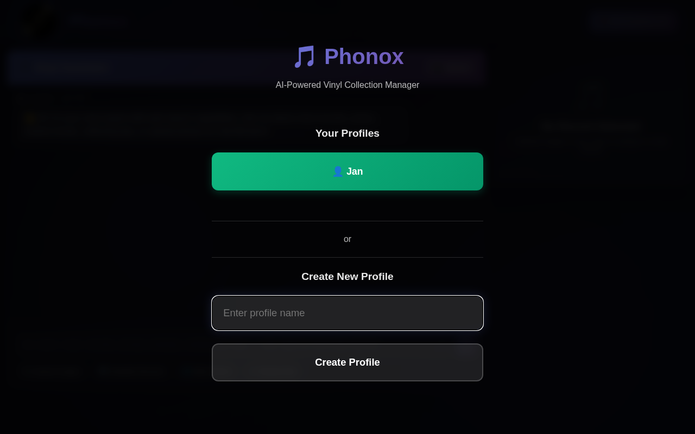

### Create a New Profile
Type a name and press **Create Profile** to get started instantly — no account, no password, no email required.

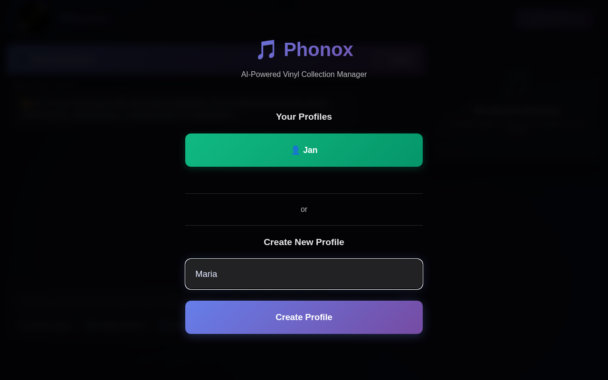

---

## Journey 2 — Main Dashboard

After selecting a profile, the main interface loads. The left panel is the **Vinyl Assistant** chat; the right panel shows the **Vinyl Card** — currently empty until you upload or load a record. Your collection count is always visible in the top-right corner.

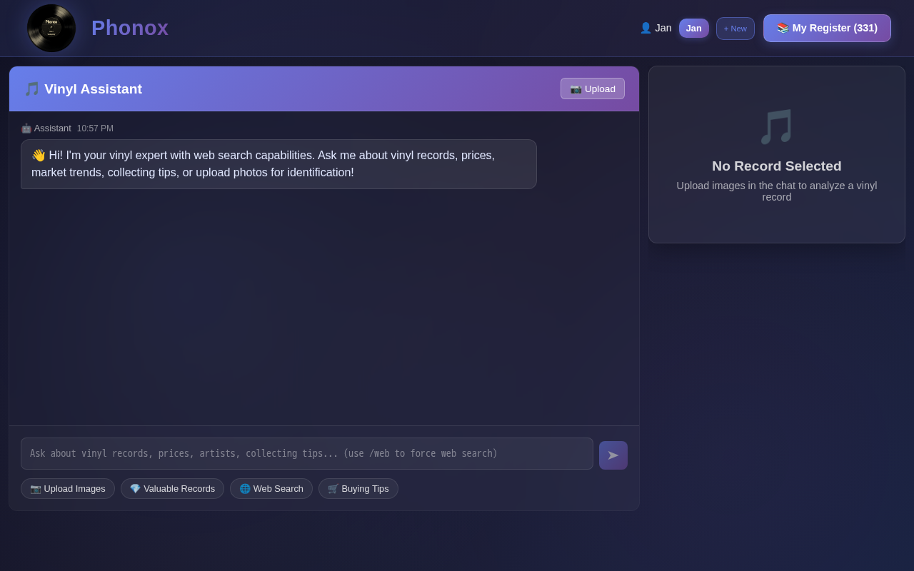

---

## Journey 3 — AI Chat — Ask Anything About Vinyl

The Vinyl Assistant is powered by Claude with live web search. Ask about a specific record, market trends, grading guides, collecting tips, or anything else vinyl-related.

### Typing a Question
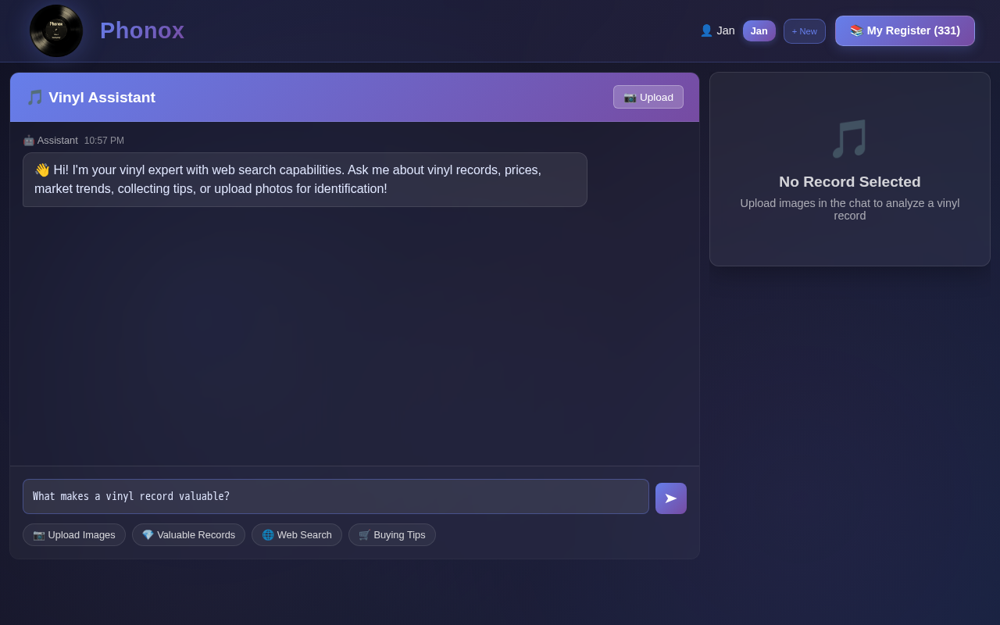

### AI Response with Web Sources
The assistant searches the web in real time and returns a structured, sourced answer. Sources are listed and clickable.

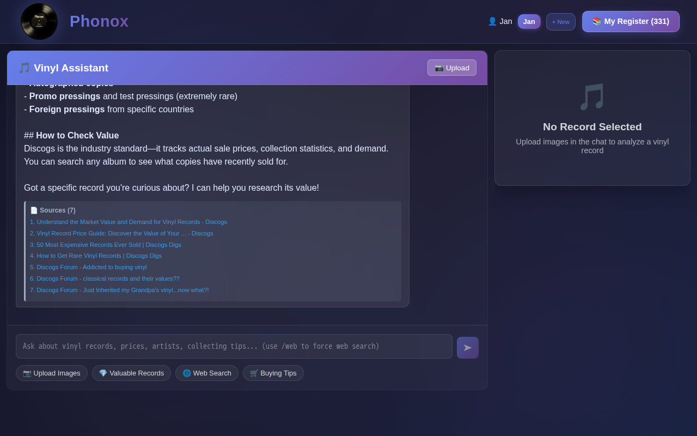

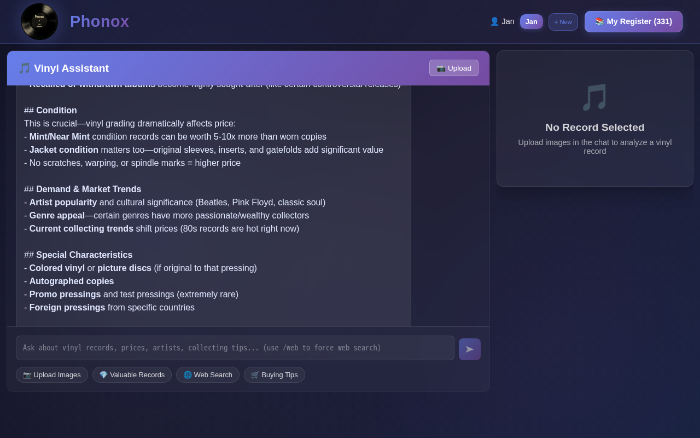

---

## Journey 4 — My Vinyl Register — Collection Overview

Press **My Register** to open your personal vinyl collection. Phonox shows all identified records with cover images, metadata, genre tags, confidence scores, and estimated market values — for Jan's collection that's **331 records totalling €8,823**.

### Grid View
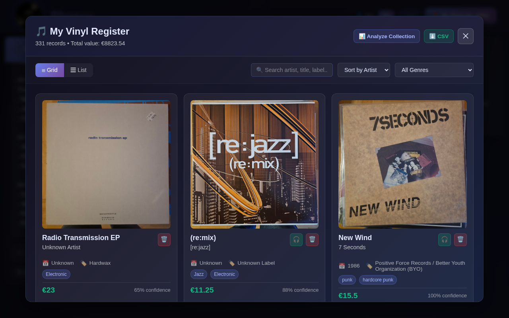

### List View
Switch to list view for a denser, scan-friendly layout.

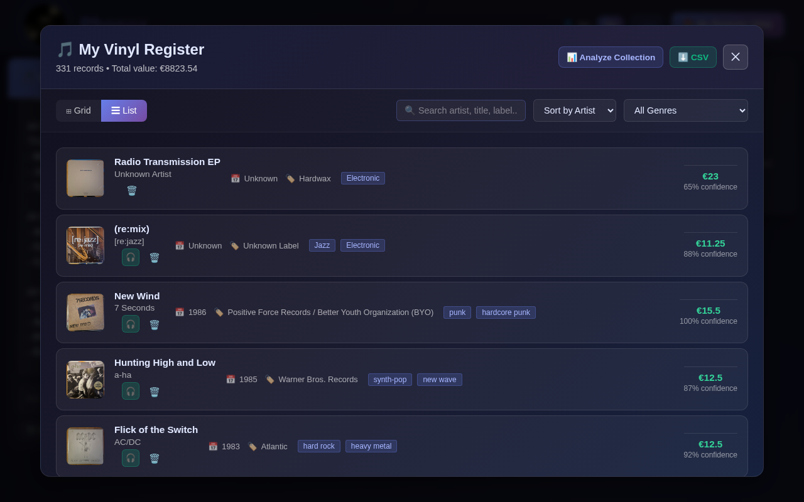

### Search & Filter
Filter by artist, title, label, or genre instantly. Sort by artist, year, value, or confidence.

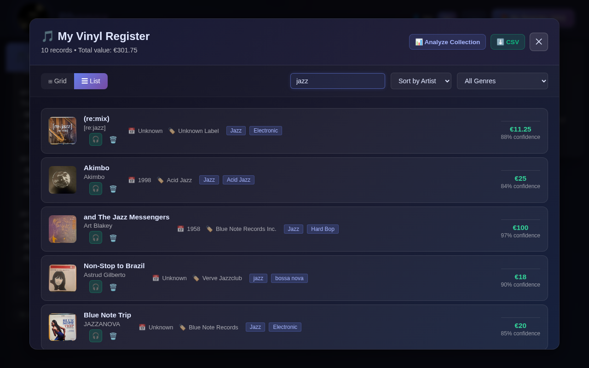

---

## Journey 5 — Vinyl Card — Record Detail

Click any record in the register to load it into the Vinyl Card. All metadata, album images, Spotify link, catalog number, condition, and estimated market value are displayed at a glance.

### Record Loaded — Art Blakey, Blue Note 1958
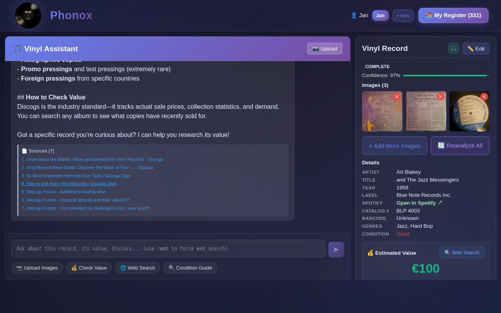

### Edit Metadata
Press **Edit** to correct or enrich any field — artist, title, year, label, catalog number, barcode, genres, condition, estimated value. All changes are saved when you press **Update in Register**.

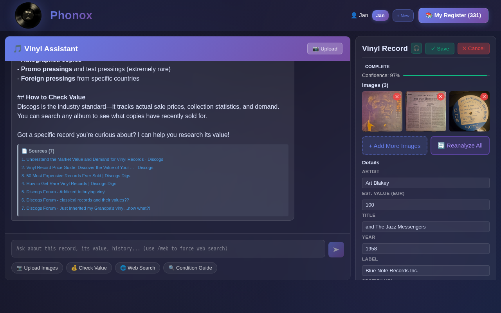

---

## Journey 6 — AI Collection Analysis

Press **Analyze Collection** inside the register for a deep AI-powered analysis of your entire collection: genre breakdown, investment highlights, rare finds, and personalised collecting recommendations.

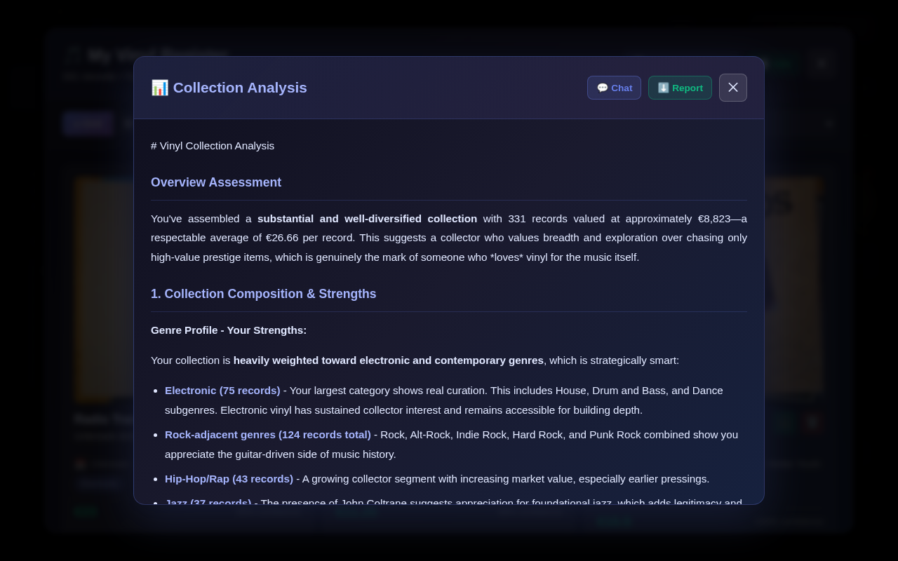

---

## Journey 7 — Mobile View

Phonox is fully responsive. On mobile, the chat and vinyl card panels can each be expanded to full screen with the **⇧** button.

### Mobile — Main Interface
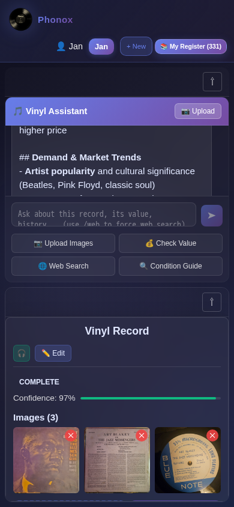

### Mobile — Vinyl Card Expanded
Full record detail, image gallery, Spotify link, and market value in the palm of your hand.

---

## Journey 8 — Live Upload & AI Identification

The headline feature: photograph a vinyl label, upload it to Phonox, and watch the AI identify it in seconds — artist, title, year, pressing variant, genre tags, condition, and market value — backed by live web search.

The record below is a **Danzig – Danzig (1988)** original US pressing on Def American, Catalog #DEF 24208, produced by Rick Rubin. Phonox identified it correctly with **97% confidence** and priced it at **€280 (VG+)** using real-time Discogs data.

### Step 1 — Upload the Image
The user clicks **📷 Upload Images** and selects a photo of the vinyl label. The chat confirms the upload immediately.

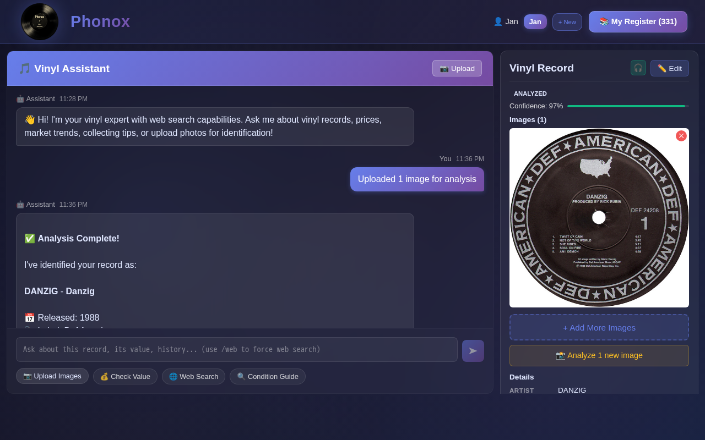

### Step 2 — AI Analysis Result
The assistant returns a structured identification: band, album, year, pressing notes, pressing variants, and an estimated market value with an explanation.

### Step 3 — Full Metadata + Discogs Sources + Value Card
The right-hand Vinyl Card updates in real time with complete metadata, a Spotify link, and a live-market value card. The chat panel shows the 7 Discogs sources used to compute the price.

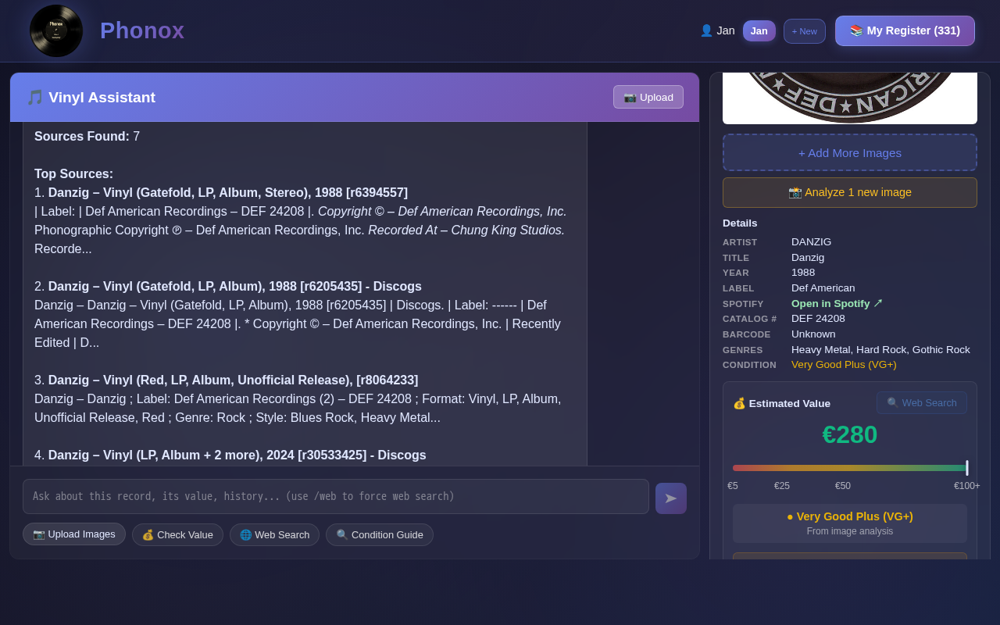

---

## Feature Quick Reference

| Feature | Where to find it |
|---|---|
| Profile selection | App startup modal |
| AI vinyl chat | Left chat panel |
| Upload images for analysis | Upload button in chat header or "📷 Upload Images" quick button |
| View identified record | Right panel — Vinyl Card |
| Edit metadata | ✏️ Edit button on Vinyl Card |
| Save to collection | "Add to Register" / "Update in Register" button |
| Browse collection | 📚 My Register button (top right) |
| Search collection | Search bar inside My Register |
| Market value lookup | "💰 Check Value" → Web Search button on Vinyl Card |
| Re-analyze with AI | 🔄 Reanalyze All button on Vinyl Card |
| AI collection report | Analyze Collection button inside My Register |
| Export collection | CSV button inside My Register |
| Mobile full-screen panels | ⇧ expand button on each panel header |
